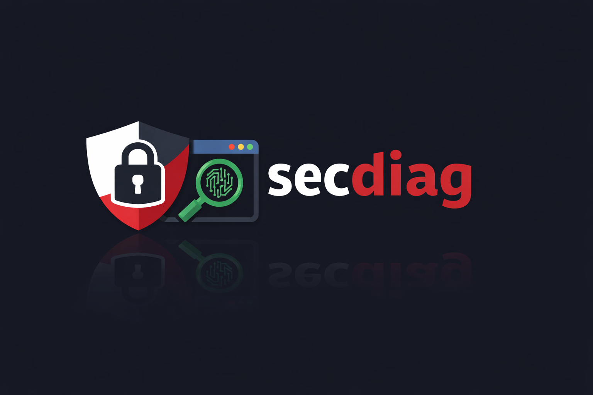

<p align="center">
  <br/>
</p>

<p align="center">
  Terminal-based security diagnostics for backend engineers.
  <br/>
  <br/>
  <a href="https://github.com/ferreirazdev/secdiag/blob/main/LICENSE">
    
  </a>
  <a href="https://goreportcard.com/report/github.com/ferreirazdev/secdiag">
    
  </a>
  <a href="https://pkg.go.dev/github.com/ferreirazdev/secdiag">
    
  </a>
  <a href="https://github.com/ferreirazdev/secdiag/issues">
    
  </a>
</p>

<p align="center">
  <sub>Built with <a href="https://golang.org">Go</a> and <a href="https://github.com/charmbracelet/bubbletea">Bubble Tea</a></sub>
</p>

---

## Table of Contents

- [Table of Contents](#table-of-contents)
- [Introduction](#introduction)
- [Features](#features)
- [Getting Started](#getting-started)
- [Project Structure](#project-structure)
- [Roadmap](#roadmap)
- [Contributing](#contributing)
- [License](#license)

---

## Introduction

**secdiag** is an interactive TUI (Terminal UI) built in Go. Run quick security checks against your servers and APIs—TLS configuration, security headers, and common misconfigurations—without leaving the terminal.

Backend services often ship with weak TLS, missing security headers, or exposed ports. secdiag helps you catch these issues early with a focused, keyboard-driven interface. No browser, no dashboards—just point it at a host and get a clear security snapshot.

**Best for:** API maintainers, SREs, and developers who want fast, repeatable security checks during development and deployment.

---

## Features

- **Interactive TUI** — Navigate and run checks from the keyboard
- **TLS analysis** — Versions, cipher suites, certificate validity, self-signed detection
- **HTTP security headers** — HSTS, CSP, X-Frame-Options, X-Content-Type-Options, Referrer-Policy
- **Severity levels** — Findings tagged as LOW / MEDIUM / HIGH
- **Security score** — Simple 0–100 score per target
- **Graceful exit** — Ctrl+C and timeouts handled cleanly

---

## Getting Started

**Prerequisites:** Go 1.21+

**Clone and run:**

```bash
git clone https://github.com/ferreirazdev/secdiag.git
cd secdiag
make run
```

Or run without installing:

```bash
go run ./cmd/secdiag
```

**Build a binary:**

```bash
go build -o secdiag ./cmd/secdiag
./secdiag
```

Launch the TUI, then follow the on-screen prompts. Use **q** or **Ctrl+C** to quit.

---

## Project Structure

```
secdiag/
├── cmd/secdiag/          # Entrypoint
├── internal/
│   ├── app/              # Application flow & orchestration
│   ├── core/             # Analyzer interface & result types
│   ├── analyzers/        # TLS, headers, ports, etc.
│   ├── tui/              # Terminal UI (Bubble Tea)
│   └── infra/            # HTTP client, DNS, shared infra
└── Makefile
```

---

## Roadmap

| Version | Focus |
|--------|--------|
| **v0.1** | TUI, TLS analyzer, headers analyzer, severity levels, security score |
| **v0.2** | Port scanner, DNS analyzer, JSON export, headless CLI (`secdiag scan <url>`) |
| **v0.3** | Reverse proxy checks, open redirects, rate-limit detection, configurable rules |
| **v1.0** | Plugin system, config file, HTML reports, CI mode, cross-platform releases |

---

## Contributing

Contributions are welcome. Open an [issue](https://github.com/ferreirazdev/secdiag/issues) to discuss ideas or send a pull request. For larger changes, start with an issue so we can align on design.

---

## License

This project is licensed under the MIT License — see the [LICENSE](LICENSE) file for details.
